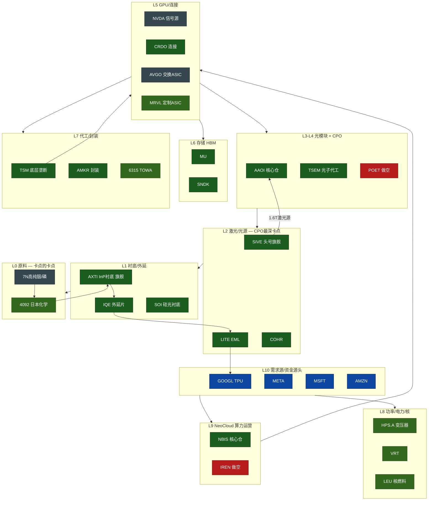

# AI 硬件产业链知识图谱（Serenity 覆盖版）

> 配套机器可读版:`supply_chain_graph.json`｜数据来源:6192 条全档案推文蒸馏 + 原文验证
> 核心范式:**不押 GPU 本体,沿资金流逆推到"人人都需要、没人造得了、多年扩不了产"的最上游近垄断卡点**

## 一、资金流总地图(从需求到最上游)



**已验证的两跳供应链(核心 alpha 引擎，原文字面命中):**
```
7N铟/磷 → 4092日本化学 → AXTI → IQE → LITE → GOOGL(TPU)
                                    SIVE → JBL/MRVL(1.6T光源)
```
> 原话:*"$LITE is a known $GOOGL supplier... $IQE is a known supplier of $LITE... $AXTI is a known supplier of $IQE"*
> 递归口诀:*"Thought $AXTI was a bottleneck? NCI is the bottleneck of the bottleneck."*

## 二、分层拼图:每家公司的产品 / 位置 / 重要性 / 他的理由

### L0 原料·化学品（卡点的卡点）
| 标的 | 产品 | 产业链位置/重要性 | 仓位 |
|---|---|---|---|
| 4092 日本化学 | InP 高纯磷+铟 | InP 原料关键供应商,~$169M 即可控制 | 卫星 |
| 7N 铟/磷 | InP 衬底原料 | 中国控 70%+;SMM 现货价=InP 紧张先行指标 | 信号源 |

### L1 衬底·晶圆材料（最赚钱板块）
| 标的 | 产品 | 位置/重要性 | 仓位 |
|---|---|---|---|
| **AXTI** | InP 衬底(端到端) | 控 40%+,与 Sumitomo 双寡头;AI buildout 单点故障 | **核心** 10x+ |
| SMTOY | InP 衬底 | 双寡头另一极 | 卫星 |
| **IQE** | 化合物外延片 | 衬底→激光外延环节,LITE 供应商;峰 +837% | **核心** |
| **SOI** | SOI/硅光衬底 | CPO 硅光西方虚拟垄断;AXTI 的硅光镜像 | **核心** 4x+ |

### L2 激光/光源（CPO 最深卡点）
| 标的 | 产品 | 位置/重要性 | 仓位 |
|---|---|---|---|
| **SIVE** | InP DFB 激光阵列 | 全球少数 DFB 供应商;供 JBL 1.6T;CPO 最清晰拐点 | **头号旗舰** ~15x |
| **LITE** | EML/VCSEL/空芯光纤 | 控 EML;GOOGL TPU 供应商;sold out until 2027 | **核心** |
| **COHR** | EML+金刚石散热 | 与 LITE 并列激光卡点;Safest Longs | **核心** |
| MTSI / Riber / VECO | CW激光 / MBE / MOCVD 设备 | 外延设备与可比锚 | 卫星 |

### L3 光模块·收发器
| 标的 | 产品 | 位置/重要性 | 仓位 |
|---|---|---|---|
| **AAOI** | 800G/1.6T 光模块+自有激光 fab | 美国最大 800G/1.6T 产能;垂直整合 | **核心** 6-7x |
| JBL | 1.6T LRO ODM | 用 SIVE 光源(论点验证) | 卫星 |
| POET | 光引擎/interposer | 单客户集中+易被设计绕过 | **做空** |

### L4 CPO·光子代工·检测（2026 头号主题;Optical TAM $15b→$154b）
| 标的 | 产品 | 位置/重要性 | 仓位 |
|---|---|---|---|
| **TSEM** | 硅光特种代工 | 光子学的 TSM;top CPO pick;40天翻倍 | **核心** 2x |
| 3105 Win Semi | 化合物代工 | 坐在几乎所有卡点上;AVGO 入股 | 卫星 |
| 6830 MSSCorps | CPO 检测 | 功能性垄断,目标 90% 份额 | 卫星 |
| 3363 FOCI / 6451 Shunsin | FAU 光纤阵列/光封装 | 台湾 CPO 隐形供应链 | 卫星 |
| MRVL / AVGO | CPO ASIC / 交换 ASIC | 连接激光源与超大厂;NVDA→AVGO→TSM 传导环 | 卫星/信号 |

### L5 GPU·连接（多作信号源,偏好上游而非 GPU 本体）
| 标的 | 产品 | 位置/重要性 | 仓位 |
|---|---|---|---|
| NVDA | GPU | 传导链起点+**信号源**(注资预示下一卡点) | 信号源(Hold/Sell) |
| CRDO | AEC 有源电缆 | AI 连接;CES 谣言-25.7%加仓 | 核心 |
| ALAB | PCIe/CXL retimer | 76%利润率,客户全 Mag7;14%超买后清仓反手空 | 卫星 |
| AMD | GPU | OpenAI 合同 re-rating | 卫星 |

### L6 存储·HBM（组合曾占 35%）
| 标的 | 产品 | 位置/重要性 | 仓位 |
|---|---|---|---|
| MU | DRAM/HBM | 下个 NVDA,fwd P/E 11.6 | 核心 |
| SNDK | NAND | Q3 营收大爆($4.6B vs 估$2.9B) | 核心 |
| SK海力士/三星 | HBM/DRAM | Toll Collector,fwd P/E 4-5x | 卫星 |

### L7 代工·封装·测试
| 标的 | 产品 | 位置/重要性 | 仓位 |
|---|---|---|---|
| TSM | 晶圆代工 | 底层 monopoly,一切算力依赖;PT $450+ | 核心 |
| AMKR | OSAT 封装 | AI DC 建设受益 | 核心 |
| 6315 TOWA / LPK / AEHR / CPSH / INTC | HBM4模塑/玻璃基板设备/测试/散热/国家代工 | 各封测细分卡点 | 卫星 |

### L8 功率·电力·能源（AI 电力主题）
| 标的 | 产品 | 位置/重要性 | 仓位 |
|---|---|---|---|
| HPS.A | 变压器 | 23% 份额,DPA 总统令 | 卫星 |
| NVTS/WOLF/POWI/XFAB | GaN/SiC/800VDC 功率 | 功率半导体 | 卫星 |
| XLU/VRT/LEU/FLNC | 电力ETF/DC基础设施/核燃料/储能 | 电力总量与核燃料卡点 | 卫星 |

### L9 NeoCloud（早期最高信念主题）
| 标的 | 产品 | 位置/重要性 | 仓位 |
|---|---|---|---|
| NBIS | 算力租赁 | Mag7 合同型(MSFT 17B);下个微软;Margins>Capacity | 核心 ~3x |
| CIFR/BITF | 矿工 pivot AI | 获利后清仓集中进 NBIS | 卫星 |
| IREN | 矿工 pivot AI | 需持续增发稀释 | **做空** |

### L10 超大厂（需求源+资金源头）
GOOGL(TPU 拉动光链) · META · MSFT(NBIS 合同) · AMZN —— capex 洪流起点,也是供应链终点。

### L11 应用·相邻主题
RKLB(火箭,PT$500,核心) · RPI(边缘AI,~3x) · CRCL(USDC,1月+148%) · HIMS(轧空主题)

## 二补、中日文披露的新增卡点标的（二轮增补）

> 仅在中/日文推文出现,纯英文分析遗漏。完整见 `cjk_addendum.md`。

| 标的 | 产品 | 层 | 位置/理由 |
|---|---|---|---|
| **NGK / 5333.T** | 薄膜铌酸锂(TFLN)晶圆 | L1 衬底 | 下一代光调制材料;"实质性垄断" |
| **古河电工 Furukawa** | CPO 光器件/光纤 | L4 CPO | 机构下一轮轮动方向(CPO/MTSI/古河) |
| **6451 Shunsin** | 光封装 | L4 CPO | NVDA CPO 链罕见已 derisk;日本散户买不到 |
| **Harmonic Drive / 6324.T** | 谐波减速器(机器人关节) | L11 机器人 | 人形机器人关节卡点;亲赴日本调研 |
| **$SSYS** | 人形机器人骨架(3D打印) | L11 机器人 | 供 Boston Dynamics Atlas/Meta 人形 |
| **$AIXA(AIXTRON)** | MOCVD 外延设备 | L2 设备 | **刻意回避**:偏好高Beta而非慢爬坡设备股 |

**新主题:机器人**(谐波减速器/人形骨架)是首轮完全遗漏的相邻 L11 主题。
**持仓硬数字:** 他自述覆盖**全球 InP 衬底产能~30%、InP 原料~25-30%**(InP 卡点链是绝对主线)。

## 三、卡点的两大失效模式（他的风控清单,据此做空）
1. **Designed-out（被垂直整合绕过）** → 据此做空 **POET**(MRVL 取消采购)。
2. **Not material（卡点无法转化为收入）** → 以 HIMX 微透镜为反例。
3. **稀释机器（靠增发活着)** → 据此做空/规避 **IREN/SLNH/BOT**。

## 四、如何用这张图(给投资/给 Agent)
- **正向**:看到某超大厂 capex/某 NVDA 注资 → 沿图向上游逆推,找该环节的近垄断小市值标的。
- **反向**:看到某热门标的 → 在图中定位它属于哪层、上游卡点是谁(可能更值得买)、是否处于"易被设计绕过"层(可能该空)。
- **估值**:用同层可比公司市值衡量错配,**禁用 P/E**,看 qualification cycle 拐点。
